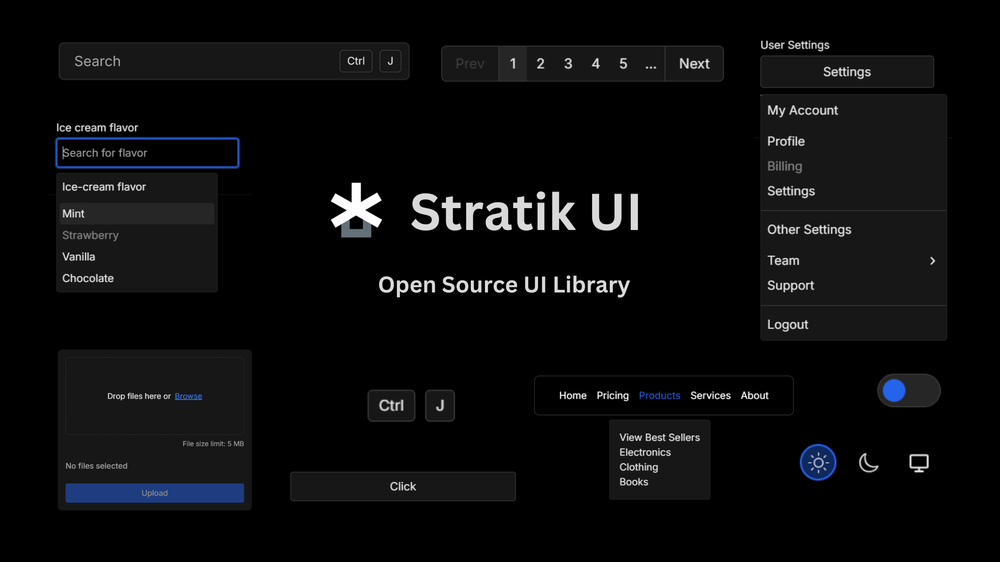

# StratikUI

## About

StratikUI is a collection of accessible, composable, and performant React components, hooks, and primitives designed in default along with accessible React Aria variant, to ensure accessibility without compromising on style or performance.

## Features

- Accessible React Aria variant along with default
- Composable and performant
- Extensive collection of components, hooks, and primitives
- Customizable
- Dark mode support
- TypeScript support

## Contributions are welcome!

[Contributing Guidelines - Coming Soon]()

## Links

- [License - MIT](https://github.com/krishpatel023/StratikUI/blob/master/LICENSE.md)
- [Twitter](https://x.com/krish__23)
